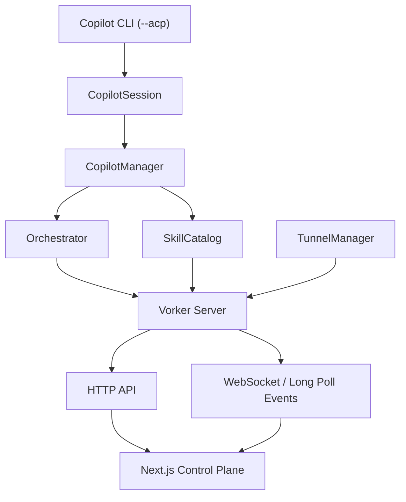
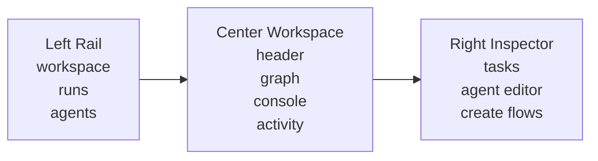
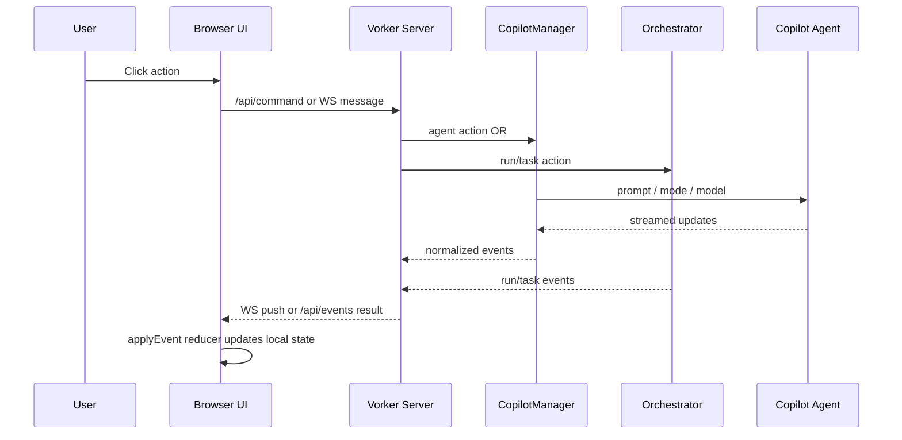

# Vorker Deep Dive

Last updated: 2026-03-16

This document is a deep technical walkthrough of the current `vorker` system as it exists in this repository.

It is intentionally much more detailed than the README. The goal is to explain:

- what the system is
- what it is not
- how the backend is structured
- how Copilot sessions are wrapped
- how runs and tasks are orchestrated
- how skill discovery and skill injection work
- how remote sharing works
- how the Next.js UI is structured
- how the centered React Flow graph is modeled
- what caused the recent bootstrap/client failures
- what was changed to fix them
- how to extend the system without guessing

## 1. Executive Summary

`vorker` is a local-first control plane around GitHub Copilot CLI running in ACP mode.

At a high level:

1. `vorker` starts one or more Copilot CLI ACP sessions.
2. Each session is wrapped as an "agent" with local file and terminal capabilities.
3. A lightweight orchestrator groups work into runs and tasks.
4. A local HTTP/WS server exposes an authenticated API and event stream.
5. A Next.js dashboard renders the control plane, including a live graph of agents, runs, tasks, and tunnel state.
6. Cloudflare Quick Tunnel can optionally expose the control plane remotely.

This is not Longshot-level autonomous multi-worktree execution yet.

It does not currently:

- create isolated worktrees per worker
- merge branches automatically
- resolve merge conflicts automatically
- maintain a durable database
- persist runs across restarts
- implement a true distributed scheduler

What it does do well:

- wrap multiple Copilot ACP sessions cleanly
- attach skills to prompts
- switch agent modes and models
- let one arbitrator plan work for worker agents
- stream activity into a browser UI
- work over localhost or through Cloudflare Quick Tunnel

## 2. Repo Map

The core implementation is concentrated in a small set of files:

| File | Role |
| --- | --- |
| `src/index.js` | CLI entrypoint and command parsing |
| `src/cli.js` | Local REPL/chat flows |
| `src/copilot.js` | ACP session wrapper, agent manager, permission handling, prompt construction |
| `src/orchestrator.js` | Run/task data model and dispatch logic |
| `src/server.js` | Authenticated HTTP API, event log, websocket handling, Next integration |
| `src/skills.js` | Skill discovery and snippet loading |
| `src/tunnel.js` | In-process Cloudflare tunnel lifecycle manager |
| `src/share.js` | CLI-first `vorker share` flow |
| `app/layout.jsx` | Next root layout |
| `app/globals.css` | Global styling and React Flow theme overrides |
| `components/control-plane.jsx` | Main client app shell and orchestration UI |
| `components/agent-graph.jsx` | Center graph built with React Flow |

## 3. Mental Model

The cleanest way to think about `vorker` is as four layers:

1. Session layer
   - "I can start and manage Copilot ACP sessions."
2. Orchestration layer
   - "I can group work into runs and tasks and dispatch them."
3. Control-plane server
   - "I can expose those capabilities safely to a browser."
4. Browser UI
   - "I can visualize the current state and send commands."

In other words:



## 4. Command Surface

`src/index.js` defines four top-level commands:

- `vorker repl`
- `vorker chat "<prompt>"`
- `vorker serve`
- `vorker share`

Important flags:

- `--cwd`
- `--copilot-bin`
- `--mode`
- `--model`
- `--auto-approve`
- `--host`
- `--port`
- `--tls-key`
- `--tls-cert`
- `--trust-proxy`
- `--allow-insecure-http`
- `--cloudflared-bin`
- `--cloudflared-protocol`
- `--cloudflared-edge-ip-version`

Two especially important entrypoints:

- `serve`
  - starts the authenticated local web control plane
- `share`
  - starts the local server and separately launches Cloudflare Quick Tunnel

## 5. Copilot Session Layer

The Copilot integration is the most important backend layer. It lives in `src/copilot.js`.

### 5.1 Core classes

There are three main abstractions:

- `CopilotBridgeClient`
- `CopilotSession`
- `CopilotManager`

### 5.2 `CopilotBridgeClient`

This object is the local bridge implementation that the ACP server can call back into.

It exposes:

- permission requests
- file reads
- file writes
- terminal creation
- terminal output reads
- terminal exit waits
- terminal kill/release

That means a Copilot ACP session can ask for:

- file access
- file writes
- shell commands
- permission gating

This is how `vorker` turns Copilot CLI into a local coding agent instead of just a text chat endpoint.

### 5.3 `CopilotSession`

`CopilotSession` is the runtime wrapper for one Copilot ACP session.

It owns:

- agent identity
- role
- notes
- attached skill ids
- auto-approve behavior
- current mode
- current model
- session state
- prompt queue
- child process lifecycle

Session state fields include:

- `id`
- `name`
- `cwd`
- `status`
- `busy`
- `sessionId`
- `title`
- `role`
- `notes`
- `mode`
- `model`
- `skillIds`
- `availableModes`
- `availableModels`
- `autoApprove`
- `createdAt`
- `lastPromptAt`
- `lastResponseAt`

### 5.4 Session startup sequence

When `start()` runs:

1. status becomes `starting`
2. `copilot --acp` is spawned
3. a special CA chain file is prepared if needed
4. ACP connection is established over NDJSON streams
5. ACP `initialize()` is called
6. ACP `newSession()` is called
7. available modes and models are stored
8. optional initial mode/model are applied
9. status becomes `ready`

### 5.5 CA-chain workaround

This repo includes a specific workaround for Copilot CLI TLS validation problems involving `api.individual.githubcopilot.com`.

The code:

- opens a TLS connection to that host
- walks the presented certificate chain
- writes a PEM file to the OS temp directory
- sets `NODE_EXTRA_CA_CERTS` when spawning Copilot CLI

This is why `vorker` can work even if the bare `copilot` binary fails on the same machine.

### 5.6 Prompt execution

`CopilotSession.prompt()`:

1. validates session readiness
2. creates a prompt id
3. serializes execution through `enqueue()`
4. emits `prompt_started`
5. sends ACP `prompt`
6. accumulates streamed text chunks into `currentResponseText`
7. emits `prompt_finished`
8. clears busy state

The session queue is important. Even though you can have many agents, one individual agent only handles one prompt at a time in order.

### 5.7 Permission flow

Permission handling has three modes:

1. auto-approve enabled
   - picks the most permissive available option in this order:
   - `allow_always`
   - `allow_once`
   - `reject_once`
   - `reject_always`
2. custom `permissionHandler`
   - used by the web control plane to ask the user
3. default deny
   - request is cancelled

### 5.8 Session update handling

`handleSessionUpdate()` normalizes ACP updates into app-friendly events:

- `agent_message_chunk`
- `tool_call`
- `tool_call_update`
- `plan`
- `current_mode_update`
- `session_info_update`
- `usage_update`

Those are then re-emitted to the control plane as simplified events.

### 5.9 `CopilotManager`

`CopilotManager` is a multi-session registry.

It is responsible for:

- creating agents
- updating agent metadata
- applying mode/model changes
- building final prompts with notes and skills
- closing one or all agents
- exposing agent snapshots to the server and UI

It is the direct boundary between "raw session objects" and "the rest of the app."

### 5.10 Prompt augmentation

When the manager prompts an agent, it can prepend:

- agent role
- agent notes
- attached skill snippets
- additional context sections provided by the caller

The final prompt format is:

```text
Agent role: ...

Agent notes:
...

Attached skills:
...

User request:
...
```

This is how both per-agent skills and per-task skills actually influence behavior.

## 6. Skill Discovery and Injection

Skills are handled by `src/skills.js`.

### 6.1 What a skill is here

In `vorker`, a skill is simply a directory containing `SKILL.md`.

The file may optionally include frontmatter for:

- `name`
- `description`

If not present:

- name defaults to the directory name
- description defaults to `"Skill"`

### 6.2 Discovery paths

`SkillCatalog.refresh()` scans:

- `<workspace>/.agents/skills`
- `<workspace>/.github/skills`
- `$CODEX_HOME/skills` if `CODEX_HOME` is set
- any extra skill roots passed in

This detail matters.

The recent `superpowers` installation you requested was the Codex-native installation flow:

- clone into `~/.codex/superpowers`
- symlink `~/.agents/skills/superpowers` to that repo's `skills/`

That installation is correct for Codex skill discovery.

However, `vorker` does **not** currently scan `~/.agents/skills` directly.

So there are two separate discovery stories:

1. Codex-native discovery
   - `~/.agents/skills/superpowers`
2. Vorker discovery
   - workspace `.agents/skills`
   - workspace `.github/skills`
   - `$CODEX_HOME/skills`

If you want `vorker` itself to see `superpowers`, you need one of:

- copy/symlink those skills into the repo's `.agents/skills`
- expose them under `$CODEX_HOME/skills`
- extend `SkillCatalog` to also scan `~/.agents/skills`

### 6.3 Snippet loading

When a prompt references skill ids, `getSkillSnippets()`:

- loads each `SKILL.md`
- truncates each one to a byte cap
- enforces a total byte cap
- returns a renderable prompt snippet bundle

This is deliberately simple and avoids overstuffing prompts with arbitrary markdown.

## 7. Orchestration Layer

Runs and tasks are implemented in `src/orchestrator.js`.

This layer is intentionally lightweight.

### 7.1 Current philosophy

The orchestrator does not pretend to be a full autonomous swarm runtime.

It does three practical things:

1. define run/task records
2. ask one arbitrator agent to plan tasks
3. dispatch ready tasks to worker agents

### 7.2 Run model

A run contains:

- `id`
- `name`
- `goal`
- `workspace`
- `arbitratorAgentId`
- `workerAgentIds`
- `status`
- `notes`
- `taskIds`
- `createdAt`
- `updatedAt`
- `lastPlanText`

Allowed run statuses:

- `draft`
- `planning`
- `ready`
- `running`
- `completed`
- `failed`

### 7.3 Task model

A task contains:

- `id`
- `runId`
- `title`
- `description`
- `status`
- `assignedAgentId`
- `skillIds`
- `modeId`
- `modelId`
- `lastDispatchAt`
- `outputText`
- `error`
- `createdAt`
- `updatedAt`

Allowed task statuses:

- `draft`
- `ready`
- `running`
- `completed`
- `failed`

### 7.4 Planning flow

`planRun(runId)`:

1. requires an arbitrator agent
2. marks the run as `planning`
3. builds a planner prompt containing:
   - run name
   - goal
   - notes
   - available worker ids
   - available agents
   - available skills
4. strongly instructs the arbitrator to avoid fake parallelism
5. asks for strict JSON output
6. parses the returned plan
7. falls back to a single task if parsing fails or yields nothing
8. creates tasks as `ready`
9. marks the run `ready`

The planner prompt has clear Longshot-inspired behavior:

- only decompose when actually parallelizable
- prefer a small number of concrete tasks
- avoid redundant worker duplication
- keep coordination overhead low

### 7.5 Dispatch flow

`dispatchTask(taskId)`:

1. resolves the run and task
2. chooses a worker if none is explicitly assigned
3. optionally applies task-specific mode/model to that worker
4. marks the task `running`
5. marks the run `running`
6. prompts the worker agent with:
   - run name
   - run goal
   - task title
   - task description
   - task skills
7. stores the response in `outputText`
8. marks the task `completed` or `failed`
9. updates run status based on remaining tasks

### 7.6 Auto-dispatch

`autoDispatchReadyTasks(runId)`:

- finds all `ready` or `draft` tasks in the run
- round-robins them across selected worker agents
- dispatches them sequentially through the manager

This is "multi-agent" at the run level, but not yet true concurrent swarm execution with worktrees, merge queues, or branch isolation.

## 8. Remote Server Architecture

`src/server.js` is the control-plane backbone.

### 8.1 What the server owns

The server wires together:

- `AuthManager`
- `LoginRateLimiter`
- `SkillCatalog`
- `CopilotManager`
- `Orchestrator`
- `EventLog`
- `TunnelManager`
- Next.js request handling
- websocket upgrades

### 8.2 Authentication model

Auth is cookie-based.

Important properties:

- session cookie name: `vorker_session`
- `HttpOnly`
- `SameSite=Strict`
- `Secure` only when transport is secure
- in-memory session map
- login rate limiting

### 8.3 Security model

The server applies:

- `Cache-Control: no-store`
- `Referrer-Policy: no-referrer`
- `X-Content-Type-Options: nosniff`
- `X-Frame-Options: DENY`
- `Cross-Origin-Opener-Policy: same-origin`
- `Cross-Origin-Resource-Policy: same-origin`
- CSP
- HSTS on secure transport

There was an important Next.js-specific change here:

The CSP had to be relaxed to allow:

- inline styles
- inline scripts
- unsafe eval in development only

Without that, the Next client shell could not run reliably.

### 8.4 Transport model

The server supports two browser-side event transports:

1. WebSocket
2. long-polling over `/api/events`

This dual-path design is important because tunneled environments often behave differently from localhost.

### 8.5 Event log

`EventLog` is an in-memory append-only queue.

It provides:

- monotonic integer ids
- `publish()`
- `getSince(cursor)`
- `waitForSince(cursor, timeoutMs)`

This is the foundation for:

- polling fallback
- bootstrap replay
- activity feed reconstruction

### 8.6 Permission broker

The browser permission flow is mediated by `createPermissionBroker()`.

It:

- stores pending permission requests
- broadcasts them to the UI
- waits for a selected option or timeout
- resolves back into the ACP permission callback

### 8.7 API surface

The core endpoints are:

| Route | Method | Purpose |
| --- | --- | --- |
| `/api/login` | POST | establish auth cookie |
| `/api/logout` | POST | destroy auth cookie |
| `/api/me` | GET | minimal auth + transport status |
| `/api/bootstrap` | GET | full current snapshot |
| `/api/events` | GET | long-poll event stream |
| `/api/command` | POST | command tunnel for all user actions |
| `/ws` | upgrade | websocket event/command channel |

### 8.8 Command protocol

`/api/command` and websocket messages both use the same logical command set:

- `list_agents`
- `list_runs`
- `list_skills`
- `create_agent`
- `update_agent`
- `send_prompt`
- `set_mode`
- `set_model`
- `close_agent`
- `refresh_skills`
- `create_run`
- `update_run`
- `plan_run`
- `create_task`
- `update_task`
- `dispatch_task`
- `auto_dispatch_run`
- `share_start`
- `share_stop`
- `permission_response`

This is a useful design choice because the UI can switch transports without changing business logic.

### 8.9 Websocket security

Websocket upgrades require:

- valid authenticated session cookie
- origin exactly matching the request base URL

This is stricter than many local tools and is the right default for remote exposure.

### 8.10 Next integration

If `.next` exists and `NODE_ENV` is not `development`, the server runs Next in production mode.
Otherwise it runs in dev mode.

All non-API traffic falls through to `nextHandler(req, res)`.

This is the reason the app now behaves as a single integrated process instead of "Node server plus static files."

## 9. Cloudflare Tunnel Layer

There are two tunnel-related entrypoints:

- `src/tunnel.js`
- `src/share.js`

### 9.1 `TunnelManager`

This is the in-app tunnel controller used by the dashboard.

It tracks:

- `state`
- `publicUrl`
- `localUrl`
- `cloudflaredBin`
- `edgeProtocol`
- `edgeIpVersion`
- `tunnelRegistered`
- `error`
- rolling log lines

It emits:

- `share_state`
- `share_log`

### 9.2 Tunnel lifecycle

`start()`:

1. builds local URL
2. spawns `cloudflared tunnel ...`
3. listens to stdout/stderr lines
4. extracts public URL
5. detects "registered tunnel connection"
6. waits for both public URL and registration
7. marks state `ready`

`stop()`:

1. sends SIGTERM
2. waits for exit
3. clears public URL and registration state
4. returns to `idle`

### 9.3 `vorker share`

`src/share.js` is the CLI wrapper around the same idea.

It:

- starts a local server bound to `127.0.0.1`
- enables `trustProxy`
- spawns cloudflared
- prints a public URL with `?transport=poll`
- intentionally biases toward long-polling for tunnel reliability

It is not the same as the in-dashboard tunnel control, but they share the same operational assumptions.

## 10. Next.js UI Architecture

The UI is now a real Next.js app instead of static assets.

### 10.1 Structure

- `app/layout.jsx`
  - HTML/body shell
- `app/page.jsx`
  - just mounts the control plane
- `app/globals.css`
  - global styling
  - React Flow styling overrides
- `components/control-plane.jsx`
  - main app logic and layout
- `components/agent-graph.jsx`
  - graph rendering

### 10.2 Visual direction

The current shell is inspired by the provided dark reference image:

- dark workstation-style shell
- left navigator
- large center pane
- right inspector
- compact chrome/header
- subtle cyan accents instead of colorful dashboard UI

The goal was not pixel-copying the reference.

The goal was to copy its structural feel:

- focus on center workspace
- clear left-side object navigation
- right-side contextual editing
- sparse dark visual language

### 10.3 Main state model

`ControlPlane` maintains a large but straightforward state shape:

- auth state
- transport state
- workspace state
- agents
- runs
- skills
- share state
- active selections
- transcripts
- pending permission request
- poll cursor
- activity feed
- UI-only form state
- UI-only inspector tab state

### 10.4 Event reducer

`applyEvent()` is effectively a reducer over backend events.

It updates:

- agent lists
- run lists
- task lists
- skill lists
- share state
- transcripts
- permission requests
- activity feed
- polling cursor

This is important architecturally:

The UI is not asking the server for a pre-rendered page state on every change.

Instead:

- bootstrap gets the initial snapshot
- websocket or polling delivers incremental events
- the browser reduces those events into local state

That pattern scales much better than constantly refetching full state.

## 11. The Bootstrap Bug and Why It Happened

You specifically hit repeated:

`Bootstrap error: failed to fetch`

The important part is that this was not just a styling issue. It was a client lifecycle issue.

### 11.1 The old failure mode

Before the recent fix:

- the initial load path depended on event-style helpers in a way that made bootstrap/transport setup more fragile
- the client could re-enter bootstrap-like work after remounts or transport churn
- websocket and polling teardown/setup were not centralized enough
- stale values could be read during transport transitions

This made it easier to end up in:

- fetch races
- duplicate connection attempts
- a noisy boot failure state that looked like a generic network problem

### 11.2 What changed

The client now has a dedicated `initializeSession()` path that:

1. closes any existing websocket
2. aborts any existing long-poll controller
3. fetches `/api/me`
4. conditionally fetches `/api/bootstrap`
5. conditionally attaches the transport
6. sets explicit `booting` / `bootError` state

There is also a `bootedRef` guard so the one-shot init effect does not re-run like a normal reactive data effect.

### 11.3 Why this is better

The new logic gives you:

- a single boot path
- explicit retry path
- clearer cleanup semantics
- less chance of transport duplication
- cleaner auth-to-session transition after login

### 11.4 Secondary client crash fix

After the shell rewrite, the browser still hit a real runtime crash:

- `localeCompare is not a function`

Cause:

- model/mode normalization assumed values were strings
- some values in agent metadata were not plain strings

Fix:

- `uniqueValues()` now string-coerces values before sorting

Without this, the shell could render the login screen but crash after authentication.

## 12. Current Layout Breakdown

The screen is now organized like this:



### 12.1 Header

The top chrome shows:

- pseudo-window controls
- app title
- transport pill
- share-state pill

### 12.2 Left rail

The left rail contains:

- workspace/access panel
- tunnel controls
- run list
- agent list

This is intentionally list-heavy and navigation-first.

### 12.3 Center workspace

The center pane contains:

- current run header
- key metrics
- the React Flow graph
- console for the selected agent
- activity feed

This is the "main operating surface."

### 12.4 Right inspector

The right pane contains tabbed contextual editing:

- `Tasks`
- `Agent`
- `Create`

This matches the reference image's "right side is for review/edit/commit-style detail work" pattern.

## 13. Graph Model

The graph lives in `components/agent-graph.jsx`.

### 13.1 Why React Flow

React Flow is being used as a state-driven topology surface rather than as a user-authored graph editor.

So the graph is:

- rendered, not edited
- fit-viewed automatically
- non-draggable
- non-connectable

That is the correct choice for a live orchestration monitor.

### 13.2 Node types

The graph synthesizes four conceptual node classes:

- workspace
- share/tunnel
- agent
- run
- task

### 13.3 Edge semantics

Edges encode meaning:

- workspace -> share
  - `share`
- workspace -> agent
  - `session`
- agent -> run
  - `arbitrates` or `worker`
- run -> task
  - task membership
- agent -> task
  - `assigned`

### 13.4 Visual semantics

Node colors are status-driven:

- running / ready
  - cyan family
- failed
  - rose/red family
- completed
  - teal family
- planning
  - blue family
- default
  - neutral zinc

Selection state is emphasized by:

- brighter cyan border
- stronger glow/shadow

### 13.5 Positioning strategy

The graph is not force-directed.

It is placed deterministically:

- workspace at the top-center
- share near the top-right
- agents down the left
- runs in the center column
- tasks to the right of each run

This makes the graph easier to scan than a physics simulation and is much more appropriate for an operations dashboard.

### 13.6 Refitting fix

After the redesign, the graph initially rendered too zoomed-out or visually underfit after login.

The fix was:

- compute a graph key from the counts and active selections
- re-mount the `ReactFlow` tree when topology changes materially
- provide explicit `fitViewOptions`

That forces a clean fit after state transitions instead of relying on an initial mount fit only.

## 14. Event Flow from Server to UI

The main runtime pattern is:



This pattern is the single most important architectural idea in the UI.

## 15. Command and Event Boundaries

There are three different kinds of "messages" in the system:

1. browser commands
   - user intent
2. internal orchestration events
   - run/task changes
3. normalized agent events
   - streamed Copilot/session updates

Keeping those separate is important.

If you ever extend this system, avoid collapsing them into one undifferentiated payload type.

## 16. Permission UX

Permission requests are handled as floating UI prompts.

Flow:

1. agent requests permission
2. `permissionBroker` stores request and broadcasts `permission_request`
3. UI displays a bottom fixed action panel
4. user selects an option
5. UI sends `permission_response`
6. broker resolves ACP permission callback

There is also expiry handling, so stale permission prompts are not left hanging forever.

## 17. Testing and Verification Already Performed

The current implementation has already been tested in several ways.

### 17.1 Static validation

- `npm test`
- `next build`
- Node syntax checks for backend modules

### 17.2 Server smoke tests

These were exercised directly:

- GET `/`
- POST `/api/login`
- GET `/api/bootstrap`
- creating an agent via `/api/command`
- creating a run via `/api/command`
- creating a task via `/api/command`

### 17.3 Browser verification

A Chromium headless render was also used to:

- log in through the actual UI
- verify there were no page errors after the recent fixes
- visually validate the three-pane shell and centered graph

### 17.4 Tunnel verification

Tunnel lifecycle had already been exercised previously:

- start
- public URL extraction
- stop

One earlier failure mode was identified as Quick Tunnel flakiness rather than a deterministic app bug.

## 18. Practical Limitations

The current design is solid for a local control plane, but you should be clear on the limits.

### 18.1 No persistence

Everything important is in memory:

- agents
- runs
- tasks
- sessions
- event log
- auth sessions

Restarting the server loses all of it.

### 18.2 No durable transcript store

Transcripts exist only in browser state plus streamed events.

### 18.3 No isolated worktrees

All workers operate in normal local filesystem context unless you manually point them elsewhere.

### 18.4 No merge or branch orchestration

This is not yet a branch-merging swarm manager.

### 18.5 No concurrent scheduler semantics

`autoDispatchReadyTasks()` is simple and sequential. It is not a global task scheduler.

## 19. Best Next Extensions

If you want to keep pushing this toward a real swarm system, the highest-value next steps are:

### 19.1 Durable state

Add a persistence layer for:

- runs
- tasks
- events
- transcripts
- share logs

SQLite would be enough.

### 19.2 Worktree isolation

Add per-task or per-run worktrees so workers do not stomp the same checkout.

### 19.3 Merge queue

Add:

- patch capture
- branch metadata
- serial merge phase
- conflict reporting

### 19.4 Better graph semantics

Add richer node types for:

- arbitrator
- planner
- validator
- tunnel
- pending permission

### 19.5 Better skill discovery

Either:

- scan `~/.agents/skills`
- or mirror Codex-installed skills into a path `vorker` already scans

### 19.6 Real queueing and concurrency

Add explicit dispatch scheduling:

- max concurrent workers
- retry policy
- backpressure
- dependency ordering between tasks

## 20. If You Need to Recreate This From Scratch

If you wanted to rebuild `vorker` in another stack, the minimum viable architecture would be:

1. process wrapper around Copilot CLI ACP
2. normalized multi-agent manager
3. run/task orchestrator
4. append-only event log
5. auth-gated server
6. websocket + polling dual transport
7. browser reducer that builds local state from events
8. graph that derives directly from that state

If you keep those boundaries, the implementation language and UI library can change without changing the architecture.

## 21. Current State in One Sentence

`vorker` is currently a solid local-first Copilot multi-agent control plane with a stronger shell, a real centered graph, cleaner boot behavior, and a simple but coherent orchestration model that is ready for persistence, worktrees, and more serious swarm semantics.

## 22. Quick Reference

### Start locally

```bash
cd /Users/lucas/Desktop/vorker
VORKER_PASSWORD=your-password npm run serve
```

### Share through Cloudflare

```bash
cd /Users/lucas/Desktop/vorker
VORKER_PASSWORD=your-password npm start -- share
```

### Rebuild/test

```bash
cd /Users/lucas/Desktop/vorker
npm test
```

### Important current files

- `src/copilot.js`
- `src/orchestrator.js`
- `src/server.js`
- `src/skills.js`
- `src/tunnel.js`
- `components/control-plane.jsx`
- `components/agent-graph.jsx`

## 23. Final Notes

The biggest conceptual win in the current codebase is not the styling.

It is that the system now has a clear, reusable shape:

- stateful agent wrapper
- thin orchestrator
- event-driven server
- browser reducer
- derived graph

That shape is what you should preserve if this grows into a much more serious orchestration tool.
